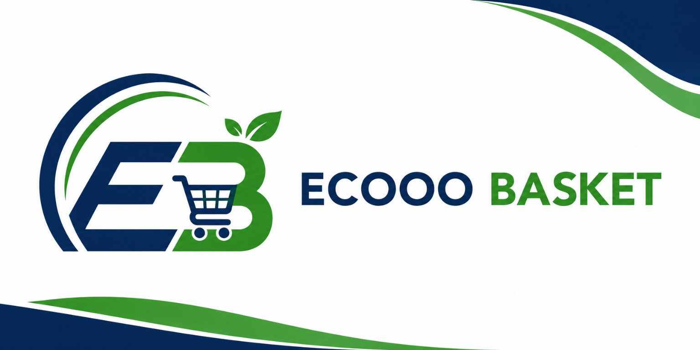

# Ecoo Basket — Corporate Portfolio Website

<div align="center">
  

  **Premium Corporate Portfolio Website**
  
  Ecoo Basket Retail Supply Chain Pvt. Ltd. — Chennai, Tamil Nadu, India
  
  
  
  
  
</div>

---

## 🌐 Overview

A premium, modern, production-ready corporate portfolio website for **Ecoo Basket Retail Supply Chain Pvt. Ltd.** — a technology-driven FMCG distribution and supply chain company headquartered in Chennai, India.

**Industry:** FMCG | Retail Distribution | Wholesale | Warehouse | Supply Chain | Procurement | AI Technology | Logistics

---

## 📁 Project Structure

```
ecooo-basket/
├── index.html                  ← Home Page
├── about.html                  ← About Us
├── services.html               ← Our Services
├── we-serve.html               ← Industries We Serve
├── supplier-partnership.html   ← Supplier Partnership
├── future-vision.html          ← Future Vision
├── founders.html               ← Our Founders
├── contact.html                ← Contact Us
├── README.md                   ← This file
└── assets/
    ├── css/
    │   ├── style.css           ← Main Design System (37KB)
    │   └── responsive.css      ← Responsive Breakpoints
    ├── js/
    │   └── main.js             ← All Interactions & Animations
    └── images/
        ├── logo/               ← 10 Brand Logo Variants
        ├── founders/           ← 3 Founder Headshots
        ├── products/           ← 6 FMCG Category Images
        ├── warehouse/          ← Warehouse Operations
        ├── services/           ← Service & Operations Photos
        └── background/         ← Hero & CTA Backgrounds
```

---

## 🚀 Quick Start

### Open Locally in Browser

1. **Navigate** to the project folder:
   ```
   d:\EB IMAGES\ecooo-basket\
   ```

2. **Double-click** `index.html` to open in your default browser.

   > **Note:** An internet connection is required for CDN resources (Bootstrap, Font Awesome, AOS, Google Fonts, Swiper).

### Alternatively — Using VS Code Live Server

1. Open the `ecooo-basket` folder in VS Code
2. Install the **Live Server** extension
3. Right-click `index.html` → **Open with Live Server**

---

## 🌍 Deployment Instructions

### GitHub Pages

```bash
# Initialize git repository
git init
git add .
git commit -m "Initial commit: Ecoo Basket Website"

# Push to GitHub
git remote add origin https://github.com/your-username/ecooo-basket.git
git branch -M main
git push -u origin main
```

Then enable **GitHub Pages** in repository settings → Pages → Source: `main` branch.

### Netlify

1. Go to [netlify.com](https://www.netlify.com)
2. Drag & drop the `ecooo-basket` folder to deploy
3. Your site will be live instantly at a Netlify URL

### Vercel

```bash
npm install -g vercel
vercel --prod
```

### Traditional / Shared Hosting (cPanel, etc.)

1. Compress the entire `ecooo-basket` folder to a `.zip`
2. Upload via cPanel File Manager or FTP
3. Extract to `public_html` or desired directory

---

## 📄 Pages

| Page | File | Description |
|------|------|-------------|
| Home | `index.html` | Hero, company intro, stats, services, process, CTA |
| About | `about.html` | Story, mission, vision, values, growth strategy |
| Services | `services.html` | 10 service cards with detailed descriptions |
| We Serve | `we-serve.html` | 13 industry cards + 6 product categories |
| Supplier Partnership | `supplier-partnership.html` | Benefits, process, partner CTA |
| Future Vision | `future-vision.html` | 8 vision pillars + technology roadmap |
| Founders | `founders.html` | 3 founder cards with real photos + leadership vision |
| Contact | `contact.html` | Form, Google Map, contact info, social links |

---

## 🎨 Design System

| Token | Value |
|-------|-------|
| Primary Green | `#1E7D3A` |
| Dark Green | `#145A32` |
| Light Green | `#6FCF97` |
| White | `#FFFFFF` |
| Light Gray | `#F8F9FA` |
| Dark Text | `#222222` |
| Heading Font | Poppins (Bold) |
| Body Font | Inter |

---

## 🛠 Tech Stack

| Technology | Version | Purpose |
|-----------|---------|---------|
| HTML5 | — | Page structure & semantics |
| CSS3 | — | Custom design system & animations |
| Bootstrap | 5.3.2 | Grid, layout, components |
| Font Awesome | 6.5.1 | Icons |
| Google Fonts | — | Poppins + Inter typography |
| AOS | 2.3.4 | Scroll animations |
| Swiper.js | 11 | Sliders |
| Vanilla JavaScript | ES6+ | Interactions & logic |

---

## ✨ Features

- ✅ **Transparent sticky navbar** with scroll-to-solid animation
- ✅ **Full-screen hero** with parallax background
- ✅ **AOS scroll animations** throughout
- ✅ **Animated counter** stats (Intersection Observer)
- ✅ **Glass-morphism cards** with backdrop blur
- ✅ **Green gradient buttons** with hover scale effects
- ✅ **Founder cards** with real professional photos
- ✅ **Product category cards** with real FMCG images
- ✅ **Process timeline** (alternating layout)
- ✅ **Contact form** with full validation
- ✅ **Google Maps** embed (Chennai)
- ✅ **WhatsApp floating button** with pulse animation
- ✅ **Back-to-top button** with smooth scroll
- ✅ **Preloader** with fade-out
- ✅ **Footer** with 4-column layout + social links
- ✅ **SEO optimized** — meta tags, OG, Twitter Cards
- ✅ **Schema.org** Organization markup (index.html)
- ✅ **Fully responsive** — Desktop, Laptop, Tablet, Mobile
- ✅ **Lazy loading** on all below-fold images
- ✅ **Auto-updating copyright year**

---

## 📱 Responsive Breakpoints

| Breakpoint | Width |
|-----------|-------|
| Extra Large | 1400px+ |
| Desktop | 1200px – 1399px |
| Laptop | 992px – 1199px |
| Tablet | 768px – 991px |
| Mobile (Landscape) | 576px – 767px |
| Mobile (Portrait) | < 576px |

---

## 👥 Founders

| Name | Role |
|------|------|
| Nirmala Devi Nagaraj | Founder & Managing Director |
| Sri Keerthana Devi Chakaravarthi | Co-Founder & Director |
| Ragavendren Chakaravarthi | Chief Strategy Officer (CSO) |

---

## 📞 Contact

**Ecoo Basket Retail Supply Chain Pvt. Ltd.**  
Chennai, Tamil Nadu, India  
📧 info@ecoobasket.com  
📞 +91 98765 43210  
🕐 Mon – Sat: 9:00 AM – 6:00 PM

---

## 📄 License

© 2026 Ecoo Basket Retail Supply Chain Pvt. Ltd. All Rights Reserved.  
This website and its content are proprietary and confidential.
